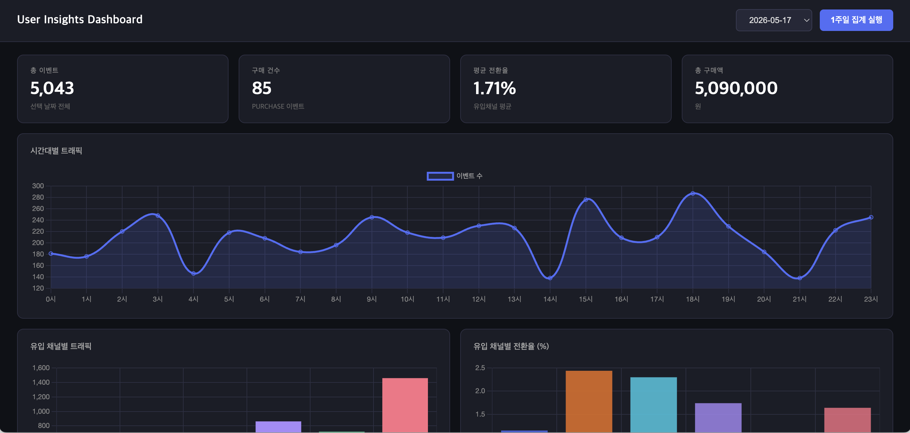
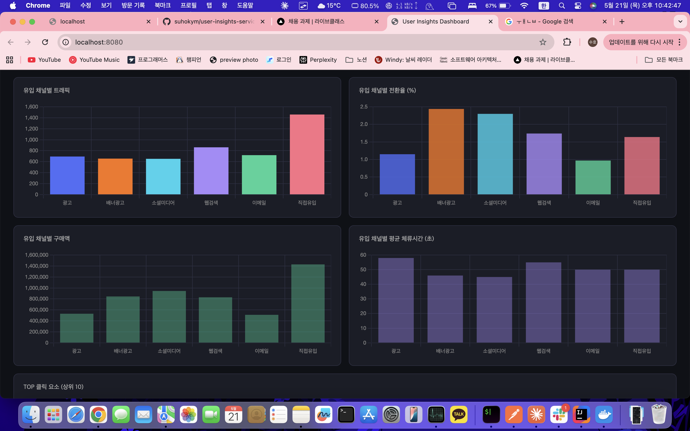
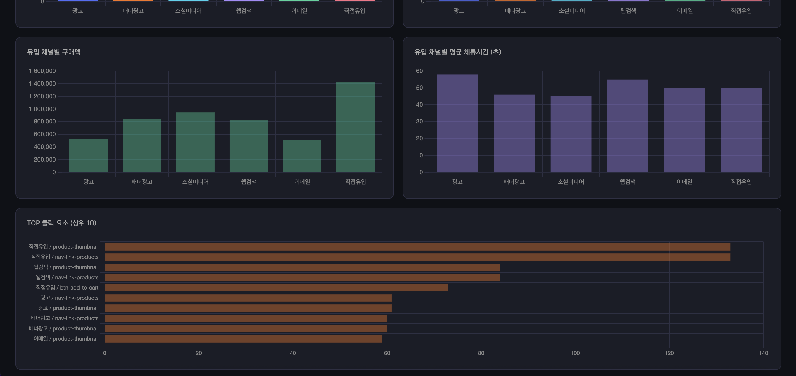
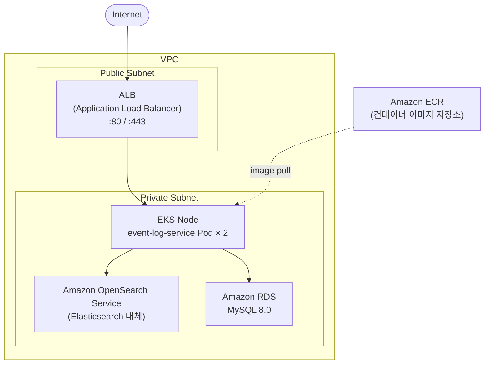

# User Insights Service

대용량 유저 행동 로그를 수집·집계하여 대시보드로 시각화하는 데이터 파이프라인 서비스입니다.

## 아키텍처

```
user-insights-service/
├── event-log-service       # Spring Boot + Apache Spark 집계 API 및 대시보드 (Port: 8080)
└── userweblog-generator    # 테스트용 유저 행동 이벤트 생성기
```

## 핵심 기술 스택

| 구분 | 기술 |
|------|------|
| Language | Java 17 / 21 |
| Framework | Spring Boot 3.5 |
| Event Storage | Elasticsearch 8.13 |
| Aggregation Engine | Apache Spark 3.5.1 |
| Database | MySQL 8.0 |
| Dashboard | Chart.js 4.4 (내장 정적 파일) |
| Build | Gradle |

## 모듈 설명

### event-log-service (Port: 8080)

Elasticsearch에 쌓인 유저 행동 로그를 Apache Spark로 집계하고, 결과를 MySQL에 저장한 뒤 내장 대시보드에서 시각화합니다.

- Elasticsearch Scroll API로 대용량 로그 조회
- Spark DataFrame으로 봇 IP 탐지 및 다차원 집계
- 집계 결과를 MySQL에 upsert
- `localhost:8080` 접속 시 Chart.js 기반 대시보드 즉시 확인

### userweblog-generator

실제 유저처럼 동작하는 합성 이벤트를 생성해 Elasticsearch에 인덱싱합니다. 개발·테스트 환경에서 데이터 시딩에 사용합니다.

- 애플리케이션 시작 시 과거 7일치 이벤트 일괄 생성 (기본 100,000건)
- 세션 단위로 PAGE_VIEW → CLICK → PURCHASE 흐름을 현실적으로 모델링
- 유입 채널(utmMedium): `ad`, `social_media`, `web_search`, `email`, `banner_ad`, `null`(직접유입)

**Elasticsearch 선택 이유**

본 프로젝트는 10만 건을 기준으로 구현했지만, 실제 서비스에서는 사용자 행동 로그가 지속적으로 대량 적재되는 구조입니다. 이런 환경에서는 저장 및 조회 성능이 핵심이라고 판단했습니다.

MySQL 같은 RDB를 사용할 경우 대용량 로그 데이터에서 집계/조회 시 성능이 크게 저하되고, 트래픽이 몰릴 때 DB가 병목 지점이 될 가능성이 높다고 생각했습니다.

반면 Elasticsearch는 두 가지 장점이 있습니다. 첫째, 분산 구조 기반의 빠른 읽기/쓰기 성능으로 대용량 로그 데이터를 빠르게 저장하고 집계할 수 있습니다. 둘째, 스키마가 고정되지 않아 향후 새로운 행동 유형이나 필드가 추가되더라도 유연하게 대응할 수 있습니다.

## 전체 데이터 흐름

```
userweblog-generator
  │  ① 세션별 이벤트 생성 (PAGE_VIEW / PAGE_LEAVE / CLICK / PURCHASE / LOGIN / SIGN_UP)
  │  ② Elasticsearch 인덱스 userweblog-events 에 벌크 인덱싱
  ▼
Elasticsearch
  │
  ▼
event-log-service (집계 API)
  │  ① POST /api/aggregation/week 요청 수신
  │  ② EsReaderService — Scroll API로 날짜별 문서 전체 조회
  │  ③ AggregationJob (Spark)
  │     - NULL utmMedium → "직접유입" 변환
  │     - 봇 IP 탐지: PAGE_VIEW ≥ 1,000 AND PURCHASE ≥ 50 인 IP 제거
  │     - 유입 채널별 트래픽 / 구매 / 체류시간 / 바운스 / 전환율 집계
  │     - 시간대별 트래픽 집계
  │     - 클릭 패턴 집계
  │  ④ 집계 결과 MySQL 저장
  ▼
MySQL (insights DB)
  │
  ▼
대시보드 (localhost:8080)
  └── GET /api/aggregation/dashboard?date=YYYY-MM-DD
```

## 이벤트 유형

| 이벤트 | 설명 |
|--------|------|
| PAGE_VIEW | 페이지 진입 |
| PAGE_LEAVE | 페이지 이탈 (durationSeconds 포함) |
| CLICK | 요소 클릭 (targetId 포함) |
| PURCHASE | 구매 완료 (amount 포함) |
| LOGIN | 로그인 |
| SIGN_UP | 회원가입 |

## UserWebLogEvent 설계 목적

UserWebLogEvent는 사용자의 웹 행동 데이터를 수집하여 세 가지 목적으로 활용하기 위해 설계했습니다.

**1. 유입 경로 분석**

`utmMedium` 필드로 사용자가 광고, 소셜미디어, 웹검색 등 어떤 경로로 유입되었는지 추적합니다. 유입 경로별 체류시간(`durationSeconds`)과 행동 패턴을 비교하여 어떤 유입 경로가 사용자의 흥미를 더 유발하는지 파악합니다.

**2. 봇/DDoS 탐지 및 차단**

`ip` 필드를 통해 비정상적인 접속 패턴을 감지합니다. 7일치 로그를 일괄 분석하여 단시간 과도 접속이나 비정상 구매 패턴을 보이는 IP를 식별하고 사전 차단합니다. 이후 분석은 차단된 IP를 제외한 정상 사용자 로그만을 대상으로 합니다.

**3. 사용자 행동 흐름 분석**

`eventType`을 PAGE_VIEW, CLICK, PURCHASE, PAGE_LEAVE 등으로 구분하여 사용자가 어떤 페이지에서 어떤 행동을 했는지 추적합니다. `uri`와 `targetId` 필드로 어떤 페이지와 상품이 흥미를 유발했는지 파악하고, `durationSeconds`로 페이지별 체류시간을 측정합니다.

## 봇 탐지 로직

Spark 집계 전 단계에서 비정상 IP를 제거합니다.

```
IP별 PAGE_VIEW ≥ 1,000  AND  IP별 PURCHASE ≥ 50
→ 해당 IP의 모든 이벤트를 집계에서 제외
```

## 집계 항목

| 집계 테이블 | 집계 단위 | 주요 컬럼 |
|------------|---------|---------|
| aggregation_result | 날짜 × utmMedium | totalCount, purchaseCount, conversionRate, totalAmount, avgAmount, avgDurationSeconds, bounceCount |
| aggregation_traffic_result | 날짜 × 시간(0–23) | totalCount |
| aggregation_click_result | 날짜 × utmMedium × targetId | clickCount |

## 대시보드 화면 구성

`localhost:8080` 접속 시 바로 확인할 수 있는 내장 대시보드입니다.

| 위치 | 차트 | 설명 |
|------|------|------|
| 상단 KPI | 총 이벤트 / 구매 건수 / 평균 전환율 / 총 구매액 | 선택 날짜 전체 합산 |
| 전체 폭 | 시간대별 트래픽 (line) | 0–23시 이벤트 수 |
| 좌 | 유입 채널별 트래픽 (bar) | utmMedium별 총 이벤트 |
| 우 | 유입 채널별 전환율 (bar) | utmMedium별 구매/유입 비율 |
| 좌 | 유입 채널별 구매액 (bar) | utmMedium별 totalAmount |
| 우 | 유입 채널별 평균 체류시간 (bar) | utmMedium별 avgDurationSeconds |
| 전체 폭 | TOP 클릭 요소 상위 10 (horizontal bar) | utmMedium / targetId별 클릭 수 |

## API 명세

### 집계 실행

```
POST /api/aggregation/week
```

어제 기준 7일치(D-6 ~ D-0)를 Spark로 집계하고 MySQL에 저장합니다.

### 날짜 목록 조회

```
GET /api/aggregation/dates
```

집계가 완료된 날짜 목록을 최신순으로 반환합니다 (최대 30건).

```json
["2026-05-20", "2026-05-19", "2026-05-18"]
```

### 대시보드 데이터 조회

```
GET /api/aggregation/dashboard?date=2026-05-20
```

```json
{
  "aggregation": [
    {
      "aggDate": "2026-05-20",
      "utmMedium": "ad",
      "totalCount": 5000,
      "purchaseCount": 150,
      "conversionRate": 3.00,
      "totalAmount": 450000,
      "avgAmount": 3000.00,
      "avgDurationSeconds": 120,
      "bounceCount": 800
    }
  ],
  "traffic": [
    { "aggDate": "2026-05-20", "hour": 0, "totalCount": 150 }
  ],
  "clicks": [
    { "aggDate": "2026-05-20", "utmMedium": "ad", "targetId": "btn-buy", "clickCount": 450 }
  ]
}
```

## 도메인 모델

```
Elasticsearch Index: userweblog-events
  └── UserWebLogDocument
        userId, sessionId, ip, eventType, uri
        targetId, amount, utmMedium, durationSeconds, occurredAt

MySQL: insights DB
  ├── aggregation_result          (날짜 × utmMedium)
  ├── aggregation_traffic_result  (날짜 × hour)
  └── aggregation_click_result    (날짜 × utmMedium × targetId)
```

## 인프라 설정

`docker-compose.yml`로 전체 인프라를 한 번에 실행합니다.

```bash
docker-compose up -d
```

| 서비스 | 포트 |
|--------|------|
| event-log-service | 8080 |
| Elasticsearch | 9200 |
| Kibana | 5601 |
| MySQL | 3306 |

## 실행 방법

**필요한 도구**

| 도구 | 버전 | 설치 |
|------|------|------|
| Docker Desktop | 최신 버전 | https://www.docker.com/products/docker-desktop |

Docker Desktop 설치 후 Settings → Resources → Memory에서 **4GB 이상** 할당을 권장합니다.

**실행 순서**

```bash
# 1. 저장소 클론
git clone <repo-url>
cd user-insights-service

# 2. 전체 서비스 빌드 및 실행 (첫 실행 시 5~10분 소요)
docker-compose up --build

# 3. 브라우저에서 대시보드 접속
# http://localhost:8080

# 4. 우측 상단 [1주일 집계 실행] 버튼 클릭 → 날짜 선택 → 차트 확인
```

코드 수정 후 재빌드가 필요한 경우:

```bash
docker-compose up --build event-log-service
```

## 스키마 설명

원시 로그는 Elasticsearch에, 집계 결과만 MySQL에 분리 저장했습니다. Elasticsearch는 비정형 이벤트를 대량으로 빠르게 적재하는 데 적합하고, MySQL은 날짜·유입채널 단위로 집계된 소량의 결과를 API로 조회하는 데 적합하기 때문입니다.

MySQL 집계 테이블은 집계 단위에 따라 3개로 분리했습니다. `aggregation_result`는 날짜 × utmMedium 단위로 전환율·구매액·체류시간을 한 행에 담고, `aggregation_traffic_result`는 시간대별 트래픽을 별도 테이블로 분리해 시계열 조회를 단순하게 유지했으며, `aggregation_click_result`는 targetId가 추가되는 클릭 패턴의 카디널리티 차이를 고려해 독립 테이블로 구성했습니다.

## 구현하면서 고민한 점

**Spark를 Spring Boot에 내장하는 방식 선택**

별도 Spark 클러스터를 두지 않고 `local[*]` 모드로 Spring Boot에 내장했습니다. 인프라를 단순하게 유지하면서 `docker-compose up` 한 줄로 실행 가능하게 하려는 목적이었습니다. 다만 Java 21과 Spark 3.5의 모듈 시스템 충돌(`InaccessibleObjectException`) 문제가 있었고, Dockerfile ENTRYPOINT에 `--add-opens` 플래그를 13개 추가해 해결했습니다.

**봇 탐지 임계값 결정**

처음엔 PAGE_VIEW 60회 / PURCHASE 3회로 설정했는데, 실제 생성된 유저 데이터도 봇으로 오분류되는 문제가 생겼습니다. 봇 생성기가 세션당 60 PV를 만들지만 하루에 수십 세션을 반복해 일 4,000 PV 이상을 찍는다는 것을 확인하고, 임계값을 PAGE_VIEW 1,000 / PURCHASE 50으로 상향해 실제 유저(일 최대 139 PV)와 명확히 구분했습니다.

**NULL utmMedium의 Spark JOIN 처리**

직접유입(utmMedium = null)이 집계 결과에 나타나지 않는 문제가 있었습니다. Spark SQL에서 `NULL = NULL`은 `false`이므로 JOIN 키로 사용할 수 없기 때문이었습니다. DataFrame 생성 직후 `when(col("utmMedium").isNull(), "직접유입")`으로 null을 문자열로 변환해 모든 하위 집계에서 정상적으로 그룹핑되도록 수정했습니다.

## DB 접속 정보 (로컬)

| 항목 | 값 |
|------|----|
| Host | localhost:3306 |
| Database | insights |
| Username | root |
| Password | 1234 |

## 대시보드 시각화





## Kubernetes 리소스

`k8s/` 디렉토리에 EKS 배포용 리소스 파일이 있습니다.

```
k8s/
├── userweblog-generator-deployment.yaml   # 이벤트 생성기 Pod 스펙
├── userweblog-generator-configmap.yaml    # 이벤트 생성기 환경변수
├── deployment.yaml                        # event-log-service Pod 스펙
├── service.yaml                           # event-log-service 네트워크 노출
└── configmap.yaml                         # event-log-service 환경변수
```

```bash
# 전체 배포
kubectl apply -f k8s/

# 상태 확인
kubectl get pods
kubectl get svc
```

### 선택한 Kubernetes 리소스의 역할

**Deployment**

Pod의 생성·삭제·재시작을 선언적으로 관리하는 리소스입니다. `replicas` 수만큼 Pod를 항상 유지하며, Pod가 비정상 종료되면 자동으로 새 Pod를 띄웁니다. userweblog-generator는 `replicas: 1`로 설정해 중복 이벤트 생성을 방지하면서도 장애 시 자동 복구가 되도록 했습니다.

**ConfigMap**

ES URI, 이벤트 생성 건수, 스케줄러 활성화 여부 등 환경별로 달라지는 설정값을 컨테이너 이미지와 분리해 저장하는 리소스입니다. 값을 바꿀 때 이미지를 재빌드할 필요 없이 ConfigMap만 수정하고 Pod를 재시작하면 됩니다.

### Kubernetes 리소스를 선택한 이유

userweblog-generator는 시작 시 과거 7일치 이벤트를 일괄 생성하고, 이후 스케줄러로 실시간 이벤트를 지속적으로 발행하는 **장기 실행 프로세스**입니다. 한 번 실행하고 종료되는 Job이 아니라 항상 살아있어야 하므로 Deployment를 선택했습니다.

ConfigMap은 Elasticsearch 엔드포인트나 생성 파라미터가 환경(로컬·스테이징·프로덕션)마다 다를 수 있기 때문에 선택했습니다. 설정을 이미지에 하드코딩하면 환경마다 이미지를 따로 빌드해야 하지만, ConfigMap으로 분리하면 같은 이미지를 재사용하면서 설정만 교체할 수 있습니다.

## AWS 아키텍처 설계



| 구성 요소 | AWS 서비스 | 역할 |
|----------|-----------|------|
| 컨테이너 오케스트레이션 | Amazon EKS | event-log-service Pod 실행 |
| 로드 밸런서 | Application Load Balancer | 외부 트래픽 → EKS 분산 |
| 이벤트 로그 저장소 | Amazon OpenSearch Service | Elasticsearch 대체 (관리형) |
| 집계 결과 DB | Amazon RDS (MySQL 8.0) | 가용성·백업 자동 관리 |
| 컨테이너 이미지 | Amazon ECR | Docker 이미지 저장 및 배포 |
| 네트워크 | VPC + Private Subnet | EKS·RDS·OpenSearch 외부 노출 차단 |
